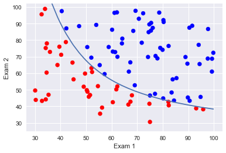

Let's see an example of a classification problem where adding polynomial features increases the performance drastically. The data is from Andrew Ng's machine learning course on Coursera (the second assignment). The data is incredibly simple and probably not very realistic, but still has pedagogical value. The data consists of two exam scores for students in a class and whether or not they passed. Based on the exam scores, we need to predict whether or not the student passed.

First, we will consider logistic regression where the predictor is a linear combination of the exam scores. The true decision boundary is sufficiently simple that this does pretty well.

Next, we will again use logistic regression but the predictor is a second order polynomial of the exam scores with an interaction term. This yields a model that achieves 100% accuracy on both the training and test data.


```python
import pandas as pd
import numpy as np
import matplotlib.pyplot as plt
import seaborn as sns
sns.set(color_codes=True)

from sklearn.linear_model import LogisticRegression
from sklearn.model_selection import train_test_split
```


```python
df1 = pd.read_csv("ex2data1.txt", names=['Exam1', 'Exam2', "Pass"])
```


```python
plt.scatter(df1['Exam1'], df1['Exam2'], color=df1['Pass'].apply(lambda x: 'red' if x==0 else 'blue' ))
plt.xlabel("Exam 1")
plt.ylabel("Exam 2")
```


    <matplotlib.text.Text at 0x1a186ce6a0>


```python
X = df1[['Exam1', 'Exam2']]
Y = df1['Pass']

clf = LogisticRegression(max_iter=10000, C=1000)
clf.fit(X,Y)
```


    LogisticRegression(C=1000, class_weight=None, dual=False, fit_intercept=True,
              intercept_scaling=1, max_iter=10000, multi_class='ovr', n_jobs=1,
              penalty='l2', random_state=None, solver='liblinear', tol=0.0001,
              verbose=0, warm_start=False)


```python
clf.score(X,Y)
```


    0.89000000000000001


```python
theta1, theta2 = clf.coef_[0][0], clf.coef_[0][1]
theta0 = clf.intercept_[0]
```

To find the decision boundary, solve $\theta_0 + \theta_1 x + \theta_2 y = 0$ for $y$, and plot $(x,y(x))$.


```python
def f(x):
    return -(theta0 + theta1*x)/theta2
```


```python
plt.scatter(df1['Exam1'], df1['Exam2'], color=df1['Pass'].apply(lambda x: 'red' if x==0 else 'blue' ))
plt.plot(df1['Exam1'].sort_values(), df1['Exam1'].sort_values().map(f))
plt.xlabel("Exam 1")
plt.ylabel("Exam 2")
```


    <matplotlib.text.Text at 0x1a182c2dd8>


```python
new_df = df1.rename(columns={"Exam1":"X1", "Exam2":"X2", "Pass":'Y'})
```


```python
new_df["X1**2"] = np.square(new_df['X1'])
new_df["X2**2"] = np.square(new_df['X2'])
new_df['X1*X2'] = new_df['X1']*new_df['X2']

X = new_df[['X1', 'X2', 'X1**2', 'X2**2', 'X1*X2']]
Y = new_df['Y']

X_train, X_test, Y_train, Y_test = train_test_split(X,Y, test_size = 25, random_state=42)

clf = LogisticRegression(max_iter=10000, C=1000)
clf.fit(X_train,Y_train)
```


    LogisticRegression(C=1000, class_weight=None, dual=False, fit_intercept=True,
              intercept_scaling=1, max_iter=10000, multi_class='ovr', n_jobs=1,
              penalty='l2', random_state=None, solver='liblinear', tol=0.0001,
              verbose=0, warm_start=False)


```python
print("Accuracy score on training data: ",clf.score(X_train, Y_train))
print("Accuracy score on testing data: ",clf.score(X_test, Y_test))
```

    Accuracy score on training data:  1.0
    Accuracy score on testing data:  1.0


To find the decision boundary, solve $\theta_0 + \theta_1 x + \theta_2 y + \theta_3 x^2 + \theta_4 y^2 + \theta_5 x y = 0$ for $y$ and plot $(x,y(x))$.


```python
theta0 = clf.intercept_[0]
theta1 = clf.coef_[0][0]
theta2 = clf.coef_[0][1]
theta3 = clf.coef_[0][2]
theta4 = clf.coef_[0][3]
theta5 = clf.coef_[0][4]

def f2(x):
    a = theta4
    b = theta5*x + theta2
    c = theta0 + theta1*x + theta3*x**2
    ret1 = (-b + np.sqrt(b**2 - 4*a*c) )/(2*a)
    ret2 = (-b - np.sqrt(b**2 - 4*a*c) )/(2*a)
    return ret1, ret2
```


```python
new_X = df1['Exam1'].sort_values()
new_Yhat1 = []
new_Yhat2 = []
for x in new_X:
    new_Yhat1.append(f2(x)[0] )
    new_Yhat2.append(f2(x)[1] )
    
```


```python
plt.scatter(df1['Exam1'], df1['Exam2'], color=df1['Pass'].apply(lambda x: 'red' if x==0 else 'blue' ))
plt.plot(new_X, new_Yhat1)
plt.xlabel("Exam 1")
plt.ylabel("Exam 2")
plt.ylim(25,102)
```


    (25, 102)




